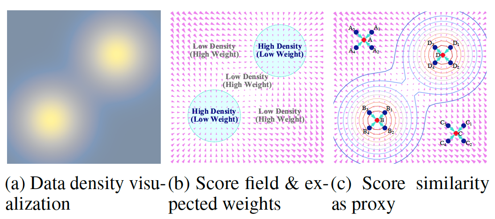

<div align='center'>

<h2><a href="https://icml.cc/virtual/2025/poster/44097">[ICML'25] Latent Score-Based Reweighting for Robust Classification on Imbalanced Tabular Data</a></h2>

Yunze Tong<sup>1</sup>, Fengda Zhang<sup>1</sup>, Zihao Tang<sup>1</sup>, Kaifeng Gao<sup>1</sup>, Kai Huang<sup>2</sup>, Pengfei Lyu<sup>2</sup>, Jun Xiao<sup>1</sup>, Kun Kuang<sup>1</sup>
 
<sup>1</sup>Zhejiang University, <sup>2</sup>Ant Group

</div>


## Abstract
Machine learning models often perform well on tabular data by optimizing average prediction accuracy. However, they may underperform on specific subsets due to inherent biases in the training data, such as associations with non-causal features like demographic information. These biases lead to critical robustness issues as models may inherit or amplify them, resulting in poor performance where such misleading correlations do not hold. Existing mitigation methods have significant limitations: some require prior group labels, which are often unavailable, while others focus solely on the conditional distribution $P(Y|X)$, upweighting misclassified samples without effectively balancing the overall data distribution $P(X)$. To address these shortcomings, we propose a latent score-based reweighting framework. It leverages score-based models to capture the joint data distribution $P(X, Y)$ without relying on additional prior information. By estimating sample density through the similarity of score vectors with neighboring data points, our method identifies underrepresented regions and upweights samples accordingly. This approach directly tackles inherent data imbalances, enhancing robustness by ensuring a more uniform dataset representation. Experiments on various tabular datasets under distribution shifts demonstrate that our method effectively improves performance on imbalanced data.





## Dataset Preparation
Please refer to [./data/Info](./data/Info) and download the corresponding dataset under the path denoted by `data_path` or `test_path`. Then run [scripts/process_dataset.sh](scripts/process_dataset.sh) to process datasets and split train/test set.

Most of our used dataset could be downloaded from either [UCI repository](https://archive.ics.uci.edu/) or [Kaggle](https://www.kaggle.com/datasets/mnavas/taxi-routes-for-mexico-city-and-quito). For the ACS dataset, please refer to [WhyShift](https://github.com/namkoong-lab/whyshift/tree/main) for downloading and preprocessing.


## Running configuration
Our method consists of several steps. We provide the necessary commands in [script/](scripts)

1. Run [scripts/train_essential_model.sh](scripts/train_essential_model.sh). This command helps you train a VAE and the score model required for computing score-based similarities.
2. Run [scripts/obtain_discrete_scores.sh](scripts/obtain_discrete_scores.sh). This command will sample several timesteps with different noise scales. The checkpoints will be saved for ultimate similarity computing, which will locate in `./weights_discrete_10_32/{dataset}/`. 
3. Run [scripts/train_classification.sh](scripts/train_classification.sh). You will train the prediction model with our score-based reweighting method. The intermediate checkpoints are stored in `./classification_process/ckpt/{dataset}/`. The training record as well as final model will be saved under `./classification_process/discrete_log_{seed}/{dataset}/train/`.
4. Run [scripts/test_classification.sh](scripts/test_classification.sh). Test the performance on selected non-causal attributes to evaluate robustness. The record will be saved under `./classification_process/discrete_log_{seed}/{dataset}/test/`.


## Citation
If you find our code useful for your research, please cite our paper.
```

@InProceedings{tong25latent,
  title = 	 {Latent Score-Based Reweighting for Robust Classification on Imbalanced Tabular Data},
  author =   {Tong, Yunze and Zhang, Fengda and Tang, Zihao and Gao, Kaifeng and Huang, Kai and Lyu, Pengfei and Xiao, Jun and Kuang, Kun},
  booktitle = 	 {Proceedings of the 42nd International Conference on Machine Learning},
  year = 	 {2025},
}

```


## Acknowledgement  
Our codebase for the diffusion models builds heavily on [TabSyn](https://github.com/amazon-science/tabsyn). The preprocess on Taxi and ACS dataset follows the setting in [WhyShift](https://github.com/namkoong-lab/whyshift/tree/main).

Thanks for open-sourcing!